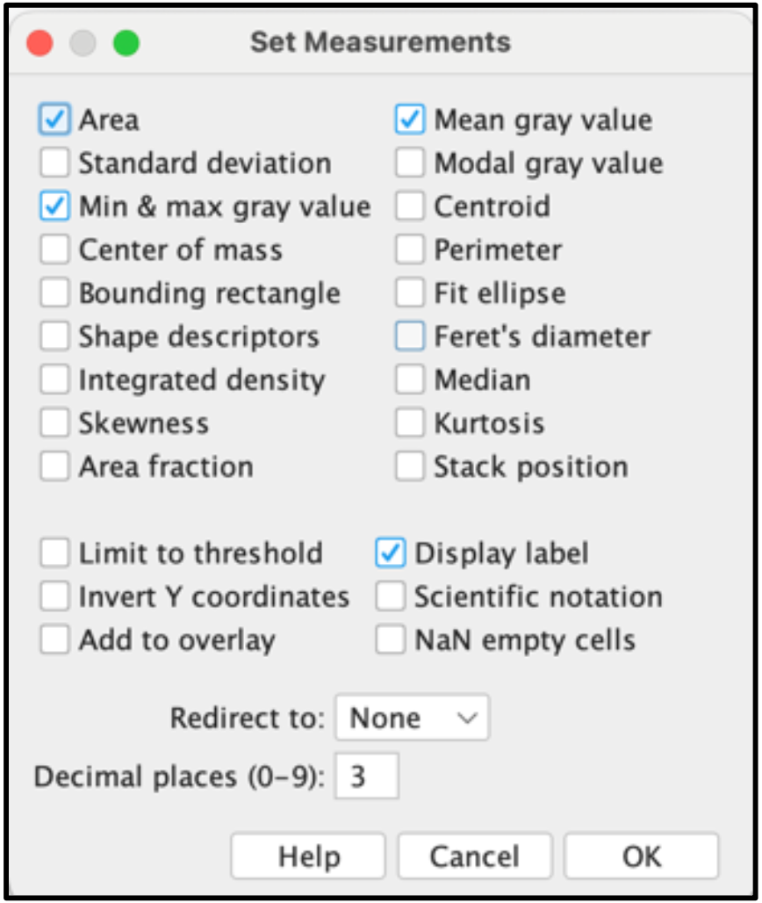

# Counting cells stained with crystal violet dye
## Data Pre-Processing 
 
For the program to work predictably, your images must be stored in a specific manner. This protocol assumes you have 9 images for each group. The format is summarized in the schematic below.

  

  

You should have one folder for each experiment (also called ‘figure’ in this document, referring to all data associated with one figure in the final publication/presentation). Inside each of these folders, you should have one sub-folder for each condition included in the experiment (eg – shNTC, drug treated, hypoxia, etc.). Inside each of these sub-folders should be 9 images associated with that group. Finally, all these folders should be inside one ‘master’ folder, as shown in the schematic above. The ‘master’ folder will be the input to the ImageJ macro program.  
 
## Image Analysis in Fiji/ImageJ 
 
1. Open Fiji.
2. Open "bw_macr.ijm".
 
NOTE: Before running the macro, make sure the results will be displayed in the desired fashion. To do this, go to Analyze -> Set Measurements…, and make sure the ‘Display label’ button is checked.

  

  
 
3. Press ‘Run’. 
A popup will ask you to select a folder. Select the master folder containing all images correctly arranged. 
4. Select the folder and press ‘Open’. You should be able to see images open and be analyzed one by one. There should also be a text box telling you the time taken to run each image. 

Once the program stops running, the results will be stored in a new folder named ‘{name of master folder}__{method used (bw or color)}_output’. Inside, you should see a folder for each figure/experiment and an additional folder named ‘Results’, which contains all csv files that will be used for further analysis in Python. 
 
In the other folders, you will find 4 folders, each containing images from all intermediate steps in the cell counting process. These are named ‘1_Mask’, ‘2_RemoveOutliers’, '3_Drawing’, ‘4_Overlay’. It is especially useful to go through the images in ‘4_Overlay’, as it shows the regions counted as cells by ImageJ overlaid on the original image. Thus, it can provide you a sense of the program’s performance.

## Analyze results in Python
The cell number is quantified by measuring the total area covered by cells in an image.
1. Open "cell_area.ipynb".
2. Click ‘Run All’
3. A message will pop up telling you to select the master folder. Click OK, and a popup will let you select a folder. Select the master folder that was the INPUT to the ImageJ program.
4. Once you select this folder, you will get another message asking you to select the folder where the resulting csv files from the ImageJ program are stored. Click OK and select the folder labeled ‘Results’ in the output folder from ImageJ.
5. Once you select the folder, the program will continue running. It should be done very quickly.

# Counting cells using GFP signal

1. Put all your photos in one folder and run the file "gfp_macro.ijm" in Fiji.
2. Analyze the results using "gfp.ipynb" in Python.
